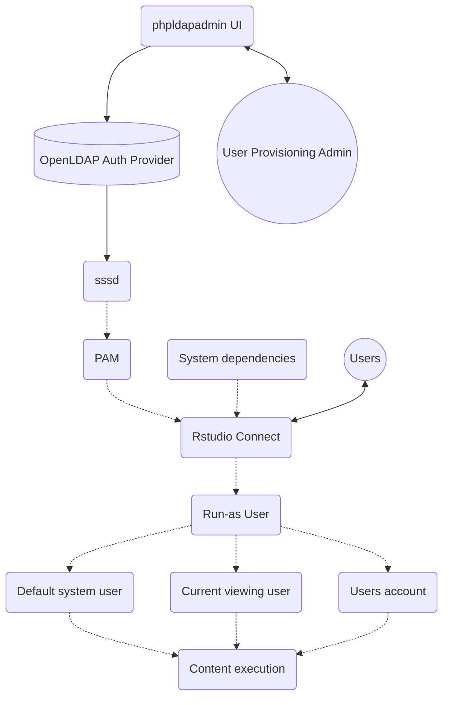

# Markdown tips and tricks 


## Markdown code chunks

Add a code chunk with: 

```
# this is code
```

A bunch of different code formats are available. Write it like this so it will recognize the language but won't exewcute it: 

```bash
/usr/lib/rstudio-server/bin/rstudio-kubernetes-launcher --help
/usr/lib/rstudio-server/bin/rstudio-kubernetes-launcher --generate-templates --scratch-path=/tmp/hello
```


Write it like this to have a header that shows a filename: 

```{.bash filename="/etc/rstudio/labels"}
[
  {
    "applicationid": "workbench",
    "label": ["value"]
  }
]
```


## Turning Quarto into markdown 

Reference: 

- <https://github.com/github/markup/issues/1069>
- <https://github.com/samcofer/cloud-storage-testing/blob/main/docs/storage-recommend.qmd>
- <https://github.com/samcofer/cloud-storage-testing/blob/61c7e7f61392e01688ee2c521612c0ee362af36f/docs/storage-recommend.qmd>

## Diagrams with Mermaid

Mermaid can be added to markdown pages with: 




## Checkboxes 

- [ ] unchecked
- [x] checked


## Collapsible section

<details>
  <summary>Click to expand!</summary>

  ## Heading
  1. A numbered
  2. list
     * With some
     * Sub bullets
</details>

From: <https://stackoverflow.com/questions/77822788/nested-indented-lists-with-collapsable-sections> 

- <details open>
  <summary><a href="#">Section 1 with a link</a></summary>

  - <details>
    <summary><a href="../src/actions/">subsection 2 with a link</a></summary>

    - a list
    - with some stuff

    > and other things

    - [x] like
    - [ ] a task list 

    </details>

  - <details>
    <summary><b>another subsection</a></summary>

    a. with another list
    b. and some other stuff
    d. [and](),
      [more](),
      [classic](),
      [md]
    e. _no need_ __of html__
    </details>

  - <details>
    <summary>last sub-section</a></summary>

    blablabla

    ```rb
    def some_code
      puts "Rails is so cool"
    end
    ```
    </details>

  - a random not collapsable section
    > legacy. Should be restructured.

    ```js
    console.log("look what I found, a new js framework. Still no real alternative to rails though")
    ```

  - <details>
    <summary>and another collapsable section</summary>

    ...
  </details>

- <details>
  <summary>section 2</summary>
      
  some parent content

  and another list

  - <details>
    <summary>section 2.1</summary>

      and some content
    </details>

  - <details>
    <summary>section 2.2</summary>

      and some content
    </details>
  
  - section 2.3
    and some no collapsed content

</details>
